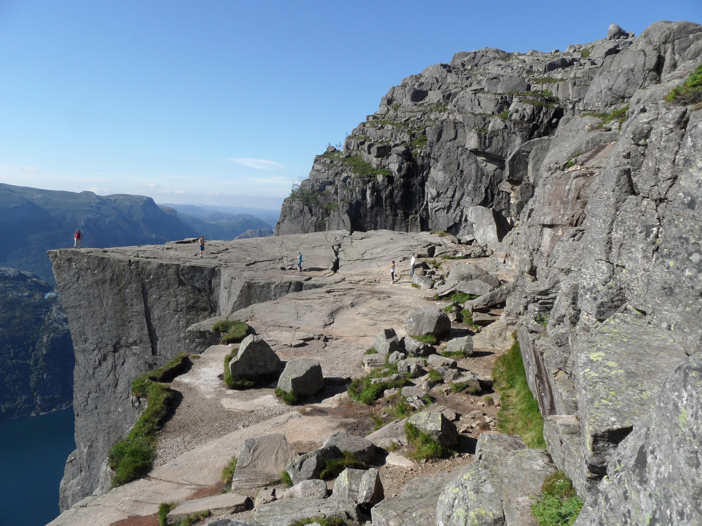

# See Preikestolen in Stavanger, Norway

Preikestolen (Pulpit Rock) is a flat rock overlooking **Lysefjorden** Fiord in Norway.
It rises 604 meters above Sea level.

## How to get there?

[Google maps](https://www.google.com/maps/place/Pulpit+Rock/@58.9868702,6.1882502,16.46z/data=!4m5!3m4!1s0x0:0x5d303484dfa9bb4c!8m2!3d58.9863737!4d6.1905263!5m1!1e4)

- Fly to Stavanger in Norway. There is a number of cheap airlines operating there, the best option being Wizzair.
- Get a ferry to Tau
- From there a bus to "PreikestolenHytta" (around 90 NOK)
- Hike the trail for about 4-6 hrs (the views are amazing)

## More information
- [How to visit Preikestolen in the cheap](https://piszek.com/2012/07/30/cheap-preikestolen-kjeragbolten/)
