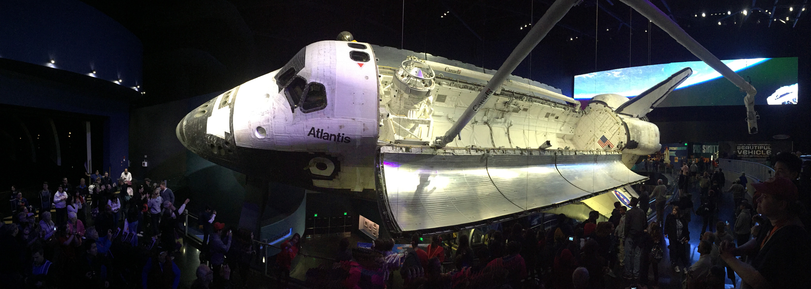

# See Space Launch

There is a [number of space ports around the world](https://en.wikipedia.org/wiki/Spaceport). The most frequently used are:
- Baikonur Cosmodrome, Baikonur/Tyuratam, Kazakhstan
- Cape Canaveral Air Force Station, Florida, USA
- Vandenberg Air Force Base, California, USA

## How to get there?
[Google Maps](https://www.google.com/maps/place/Cape+Canaveral/@28.4724261,-80.576833,13.48z/data=!4m5!3m4!1s0x88e0a3f2a5fb9a45:0x87ef91ee250f8fde!8m2!3d28.4740089!4d-80.5771737!5m1!1e4)

Cape Canaveral in Florida seems easiest to get to and you can enjoy Kennedy Space Center exhibit while you are there. Atlas 5, Delta 4 & Falcon 9 launch from this place and Space Shuttle used to make home here.

- [Cape Canaveral Launch Calendar](https://www.kennedyspacecenter.com/events/events-calendar/see-a-rocket-launch)
- While complec itself offers place to see the launches, some of them may be better enjoyed from [PlayLinda Beach](https://www.google.com/maps/place/Playa+Linda+Beach/@28.6532932,-80.6292878,15.88z/data=!4m5!3m4!1s0x0:0xc86bd678de2219be!8m2!3d28.6594871!4d-80.635601!5m1!1e4) depending on the launchpad used
- Highly [recommend checking this site](http://www.launchphotography.com/Delta_4_Atlas_5_Falcon_9_Launch_Viewing.html)